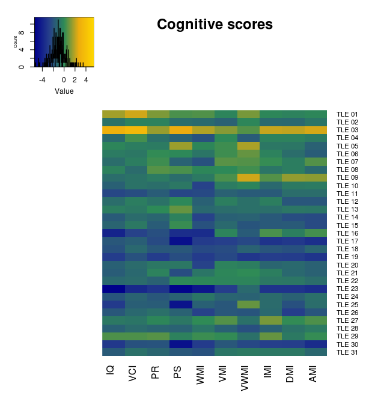
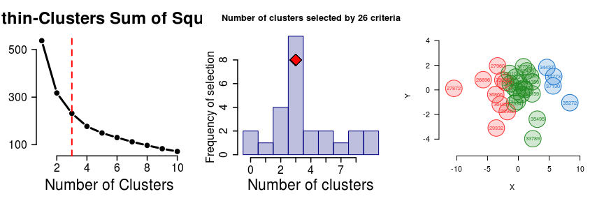
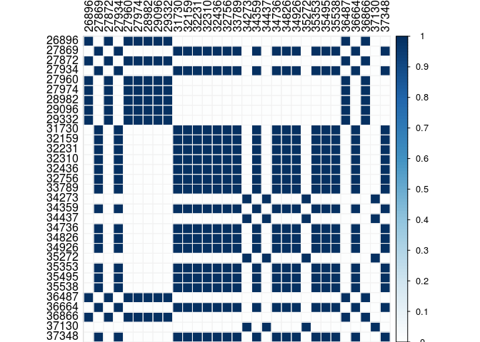
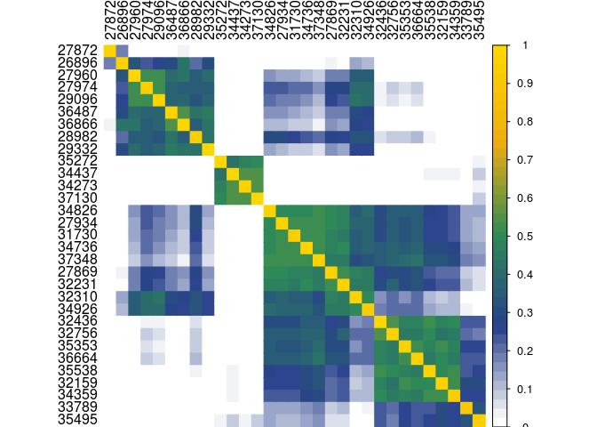
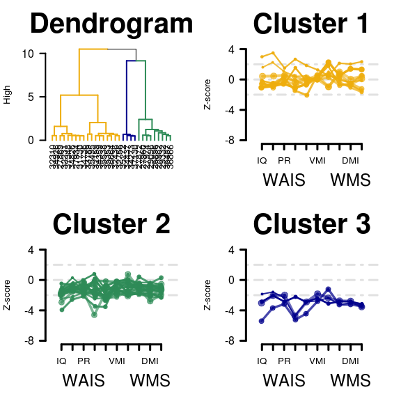
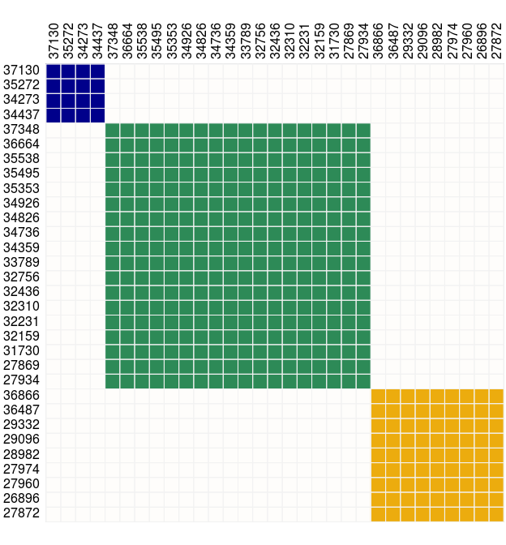

BASC: Bootstrap Analysis of Stable Clusters
===========================================
-   [Dataset of Cognitive scores](#dataset-of-cognitive-scores)
-   [Cluster selection](#cluster-selection)
-   [Similarity Matrix](#similarity-matrix)
-   [Similarity Matrix of the bootstraped data](#similarity-matrix-of-the-bootstraped-data)
-   [Stablility Matrix: 10,000 permutations](#stablility-matrix-10000-permutations)
-   [Hierarchical agglomerative clustering apply to the Stability matrix](#hierarchical-agglomerative-clustering-apply-to-the-stability-matrix)
-   [Stable Cluster Matrix](#stable-cluster-matrix)

Dataset of Cognitive scores
---------------------------

Each row represents a subject and the columns the different scales. The dendrograms is based on a hierarchical clusteritation with euclidean distances.
Patient 27872 was excluded from this cluster analysis due to his high overal IQ score. &gt; *y*=data set input
&gt; *P*=partition
&gt; *Φ*= cluster operation.

$$Y \\xrightarrow{f}  y \\xrightarrow{\\Phi}\\Phi y$$
 

Cluster selection
-----------------

based on 26 indexes of clustering, according to the majority rule, the best number of clusters will be selected. NbClusters: **"An {R} Package for Determining the Relevant Number of Clusters in a Data Set"**.

    ## initial  value 7.700014 
    ## iter   5 value 6.119946
    ## final  value 6.096441 
    ## converged

Similarity Matrix
-----------------

Quantifies the stable festures of the stochastic clustering process. Is a matrix where *Φ**i**j* = 1 if they are both in the same cluster and 0 in the contrary.
$$S\_{ij}= Pr ( \\Phi\_{ij}(y)= 1 \\mid Y \\xrightarrow{f} y$$
Stability matrix of the original data, non-bootstrap: 

Similarity Matrix of the bootstraped data
-----------------------------------------

Using a monte carlo aproximation we used stratified bootstrap (subjects withs replacement) in order to obtain a *B* independent sample of $\\hat{f}(y)$. So the Similarity boot matrix will be the sum of each of the bootstrap similarity matrix.
$$\\hat{S}\_{ij}=B^{-1} \\sum\_{b=1}^B \\Phi\_{ij} (y^{\*b}) = \\hat{S}\_{ij}^{boot} $$

Stablility Matrix: 10,000 permutations
--------------------------------------

    ## Warning in ind1:ind2: numerical expression has 20 elements: only the first
    ## used

    ## Warning in ind1:ind2: numerical expression has 2 elements: only the first
    ## used

Hierarchical agglomerative clustering apply to the Stability matrix
-------------------------------------------------------------------

Stable Cluster Matrix
---------------------

